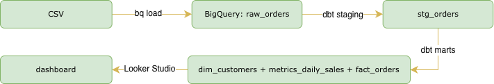
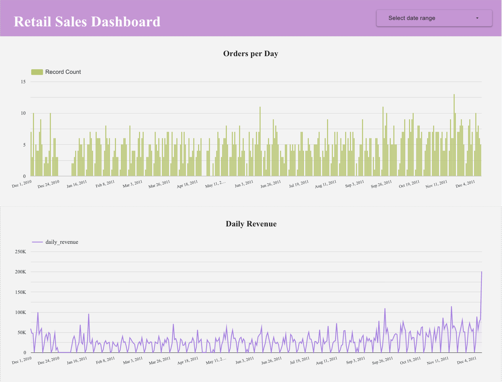
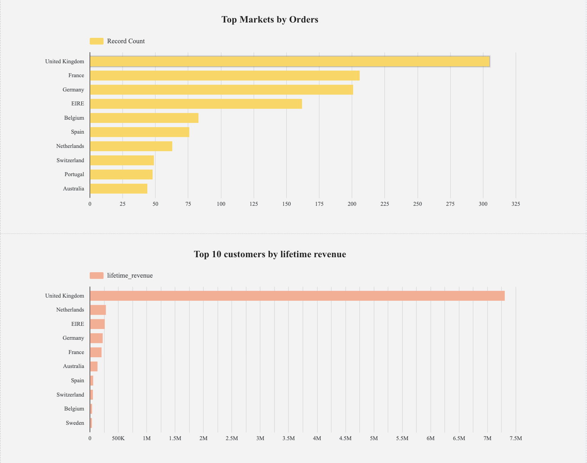
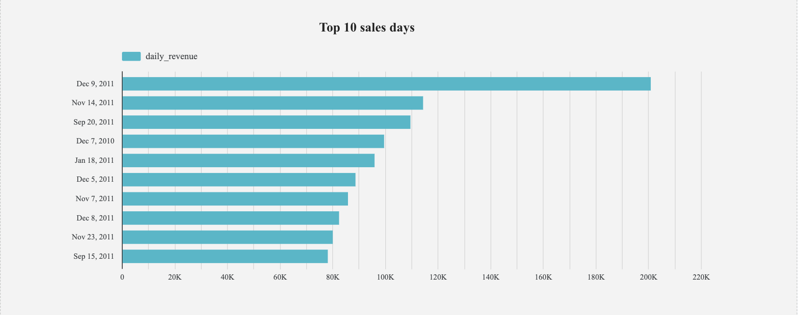

# Retail Data Pipeline (dbt + BigQuery)

**Production ELT pipeline** transforming 541k UCI Online Retail transactions into clean analytics tables + interactive Looker Studio dashboard.

## Dataset

**Source**: UCI Machine Learning Repository
**Name**: Online Retail
**Transactions**: 541,909 rows (Dec 1, 2010 - Dec 9, 2011)
**Company**: UK-based online gift retailer
**Customers**: Wholesalers + individuals (4,337 unique)
**Revenue**: ~8.18M total
| Column | Type | Description |
| ----------- | ---------------- | ------------------------------- |
| InvoiceNo | STRING | Transaction ID (C\* = cancelled) |
| StockCode | STRING | Product code |
| Description | STRING | Product name |
| Quantity | STRING→INT | Items per line |
| InvoiceDate | STRING→TIMESTAMP | MM/DD/YYYY HH:MM |
| UnitPrice | STRING→FLOAT | £ per item |
| CustomerID | STRING | Customer key |
| Country | STRING | Billing country |

## Data Flow (ELT)



## Data Models

| Model               | Type      | Rows  | Purpose                                     |
| ------------------- | --------- | ----- | ------------------------------------------- |
| raw_orders          | Source    | 541k  | Raw CSV → BigQuery                          |
| stg_orders          | Staging   | 397k  | Clean data, type casts, revenue calc        |
| fact_orders         | Fact      | 397k  | Transaction events (star schema center)     |
| dim_customers       | Dimension | 4,337 | Customer metrics (LTV, first/last order)    |
| metrics_daily_sales | Mart      | 541   | Daily KPIs (revenue, orders by country/day) |

## Quick start

### 1. GCP Setup

```bash
gcloud auth login
gcloud config set project retail-data-pipeline-491508
bq --location=US mk --dataset retail-data-pipeline-491508:retail
```

### 2. Load Raw Data

```bash
bq load --autodetect --replace --skip_leading_rows=1 \
  retail-data-pipeline-491508.retail.raw_orders \
  gs://retail-sales-4915081/raw/online-retail.csv \
  InvoiceNo,StockCode,Description,Quantity,InvoiceDate,UnitPrice,CustomerID,Country
```

### 3. dbt Pipeline

```bash
dbt init retail-data-pipeline
cd retail-data-pipeline
dbt debug
dbt run
dbt test
```

### 4. Dashboard Preview

```bash
bq query --nouse_legacy_sql "SELECT order_date,daily_revenue,orders FROM retail-data-pipeline-491508.retail.metrics_daily_sales ORDER BY 1 DESC LIMIT 10"
```

## Tech Stack

| Category        | Tool          | Role                  |
| --------------- | ------------- | --------------------- |
| Warehouse       | BigQuery      | Raw → gold storage    |
| Ingestion       | bq load       | CSV → raw table       |
| Transform       | dbt Core      | ELT models + tests    |
| Visualize       | Looker Studio | Interactive dashboard |
| Version Control | GitHub        | Repo + README         |

## Model Schemas

### **stg_orders**

```sql

safe_cast(Quantity as int64) * safe_cast(UnitPrice as float64) as revenue
parse_datetime('%m/%d/%Y %H:%M', InvoiceDate) as order_timestamp
WHERE InvoiceNo NOT LIKE 'C%' AND quantity > 0
```

### **dim_customers**

```sql
CustomerID | Country | lifetime_revenue | first_order | last_order
```

### **metrics_daily_sales**

```sql
order_date | Country | orders | daily_revenue | avg_order_value
```

## Dashboard





### Summary

> **"Production analytics pipeline reveals 8.18M revenue driven by UK market dominance and year-end seasonality. Top customers contribute disproportionate value. Ready for inventory planning, targeted marketing, and retention programs."**
